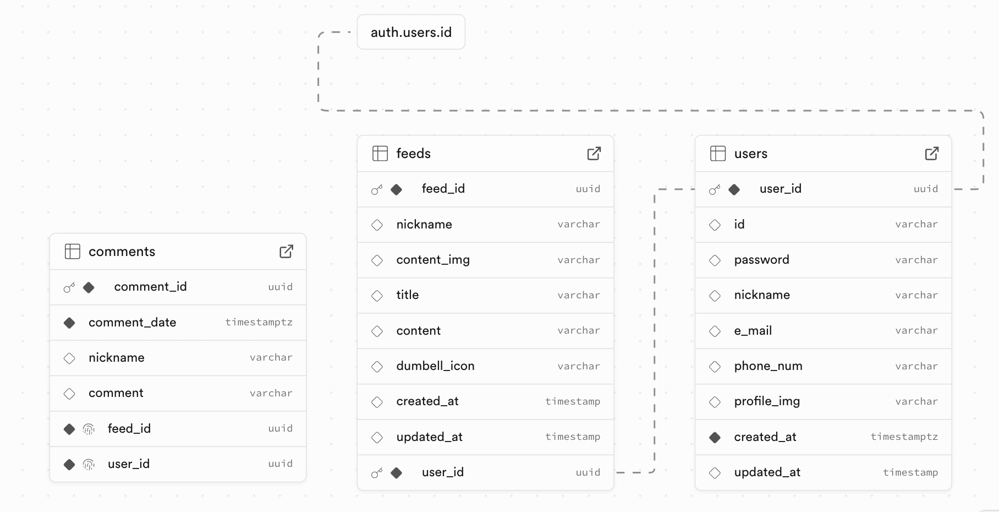
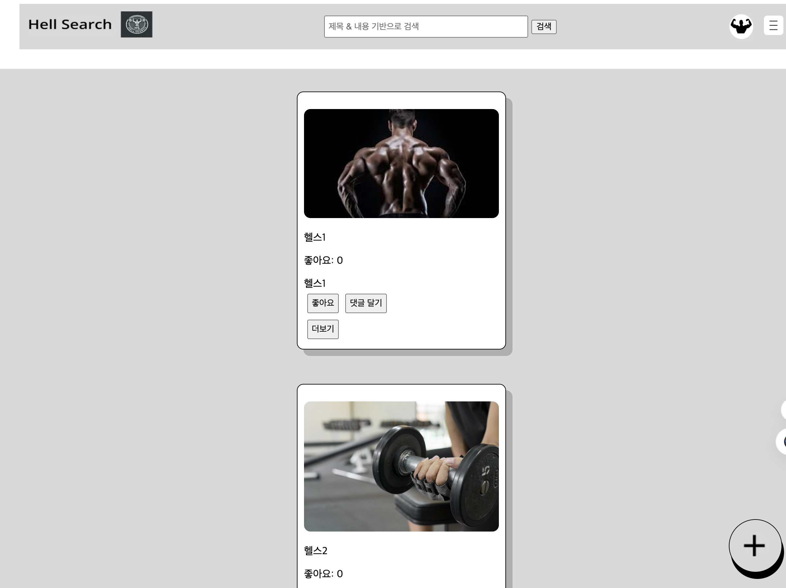
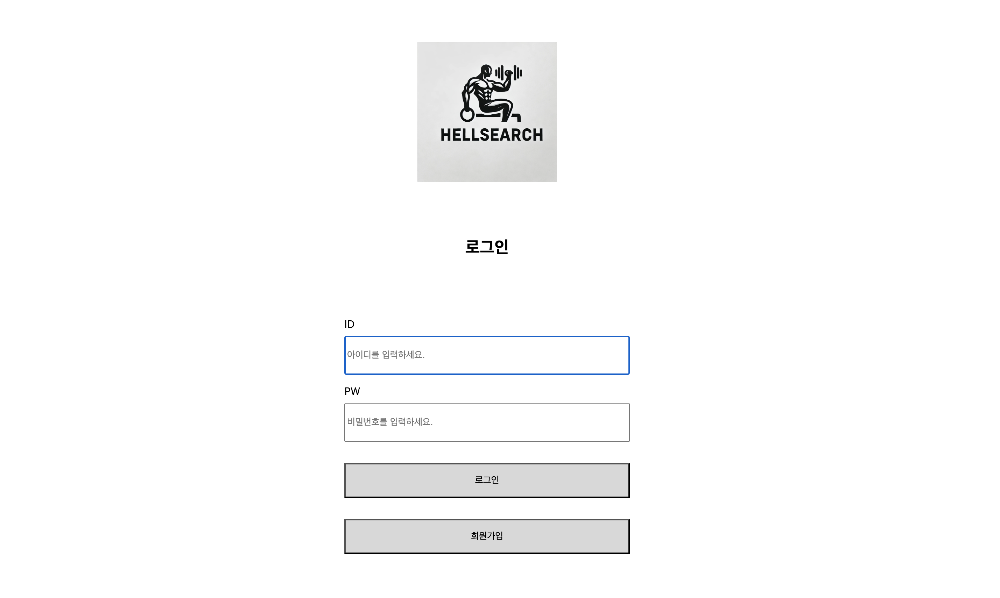
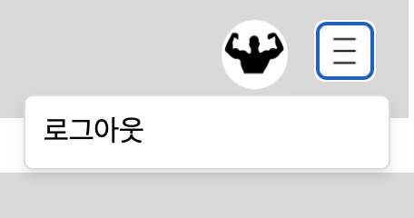
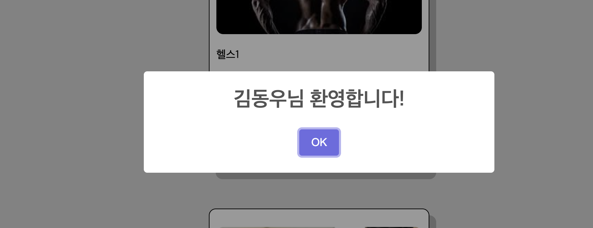
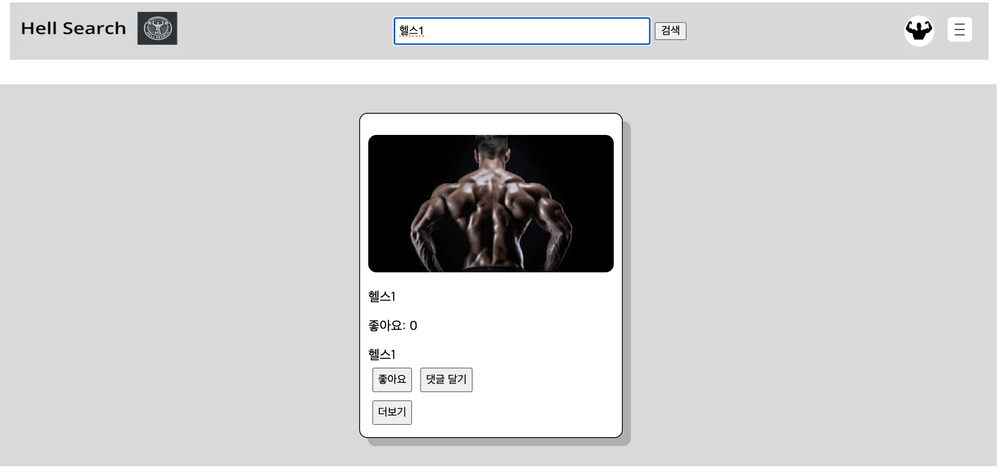

 # 🏋️‍♂️ Hellsearch (Health Community)

리액트 뉴스피드 팀 프로젝트에서 내 운동피드를 올리고 공유하는 사이트를 만들었어요 
백엔드는 supabase를 이용했습니다 
## ⚙️설치 방법

#### ▶️ 프로젝트 클론 : 
#### 🛫 개발 서버 시작 : yarn dev

#### 🔽 의존성 설치 : yarn install

#### 💅 styled-components 설치: yarn add styled-components

#### 🔔 Sweet Alert pakage 설치: npm install sweetalert2

### ✏️ 사용 방법 : 브라우저에서 로컬환경으로 실행하여 프로그램을 이용하실 수 있습니다.

-----
## 🛠️기술 스택
- **프론트엔드** : React, Vite, React Router, JS, Styled Components
- **개발 도구** : Visual Studio Code, Git
- **배포** : Vercel

🔗 프로젝트 컨벤션 정리 :
 <브랜치명 설명 예시> 
- main 배포용 브랜치 main
- dev 통합(개발)용 브랜치 dev
- feature/ 기능 개발 브랜치 feature/login
- bugfix/ 버그 수정 브랜치 bugfix/nav-bar
- hotfix/ 긴급 패치 브랜치 hotfix/payment
- chore/ 문서, 설정파일 변경 chore/update-readme
- docs/ 문서 작업 브랜치 docs/api-guide
- refactor/ 리팩토링 브랜치 refactor/homepage-ui

 <커밋 메시지> 
- feat (#이슈번호) 새로운 기능 추가
- fix (#이슈번호) 버그 수정
- docs (#이슈번호) 문서 수정
- style (#이슈번호) 공백, 세미콜론 등 스타일 수정
- refactor (#이슈번호) 코드 리팩토링
- perf (#이슈번호) 성능 개선
- test (#이슈번호) 테스트 추가
- chore (#이슈번호) 빌드 과정 또는 보조 기능(문서 생성 기능 등) 수정
- design (#이슈번호) 기능 수정 없이 스타일(CSS)만 수정

<폴더 및 파일>
- 1.디렉토리 및 폴더명
  소문자로 작성하며, 카멜케이스를 사용.
- 2.파일명
  컴포넌트 파일명: PascalCase를 사용하여 작성.
  일반 파일명: 소문자와 **하이픈(-)**을 사용하여 작성.
  이미지파일명 : img→suffix
  boolean타입 리턴 or 함수값은 : is→prefix
- 3.컴포넌트명
  PascalCase를 사용하여 작성.
  컴포넌트 파일명과 일치시킴.
- 4.CSS 클래스명
  BEM(Block Element Modifier) 규칙을 사용.
- 5.상수명
  모든 글자를 대문자로 작성하고, 단어 사이에 언더바(\_) 사용.
- 6.함수명 및 변수명
  camelCase를 사용하여 작성.
- 7.프로퍼티 및 메소드명 (React)
  camelCase를 사용하여 작성.
  메소드명은 handle로 시작.
 

## 0. 팀원 소개

<table>
   <tr>
    <td align="center"><b>김동우</b></td>
    <td align="center"><b>오원택</b></td>
    <td align="center"><b>유경민</b></td>
    <td align="center"><b>유익환</b></td>
    
  </tr>
  <tr>
    <td align="center"></td>
    <td align="center"></td>
    <td align="center"></td>
    <td align="center"></td>
    
  </tr>
  <tr>
    <td align="center">Home Login 발표</td>
    <td align="center">Feed-Main 발표자료 </td>
    <td align="center">Feed-Detail Mypage<br/</td>
    <td align="center">Feed-Add  Feed-Content </td>
    
  </tr>
</table>

- 각자 맡은 역할을 다한 뒤에도, 다른 팀원의 작업을 도와주면서 완성했습니다   

## 0-1. 프로젝트 진행 기간

- 2025.02.11 ~ 2025.02.18  

## 0-2. 프로젝트 중에는..

- 활발하게 진행 상황을 공유하기 위해 zep과 slack을 사용했어요
- 전체적인 팀 프로젝트의 진행상황을 확인하기 위해 github project를 사용했어요
- 코드리뷰하는 문화를 지향해요
- pr에 2명 이상의 approve가 있어야 develop에 merge를 할 수 있도록 설정했어요
    

## 1. 사용한 라이브러리

### @supabase/supabase-js

Supabase를 백엔드로 사용하여 실시간 데이터베이스를 사용했어요
 

### react-router-dom

React Router를 사용하여 SPA의 라우팅을 관리했어요

### styled-components

CSS-in-JS 라이브러리인 Styled Components를 사용하여 컴포넌트 스타일링을 했어요
### Sweet Alert2 pakage

Swal fire UI를 이용하여 알림 창을 스타일링 했습니다.

## 2. 대표기능

- [x] 나의 작업물을 올릴 수 있어요 
- [x] 다른 사람의 피드를 보고 열정을 얻을 수 있어요 
- [x] 다른 사람의 피드가 마음에 든다면 좋아요를 누를 수 있어요 
- [x] 회원 가입하고 나의 닉네임을 설정할 수 있어요 

## 3. 상세설명

### 1. 메인페이지 피드 조회 기능
 
- 8개씩 화면에 계속 출력됩니다
 

### 2. 로그인 / 회원가입 기능
 
- 이메일을 통해 로그인과 회원가입을 할 수 있어요
 

### 3. 게시글 작성 및 수정,삭제 기능
 
- ➕ 버튼을 이용하여 에디터로 이미지와 글을 자유롭게 수정,삭제할 수 있어요 

### 4. 로그아웃 기능
 

### 5. Sweet Alert pakege를 이용한 알림 창
 

### 6. 검색
 
- 검색 창에 원하는 제목,내용이 일치하는 결과를 검색 해볼수 있습니다
  

